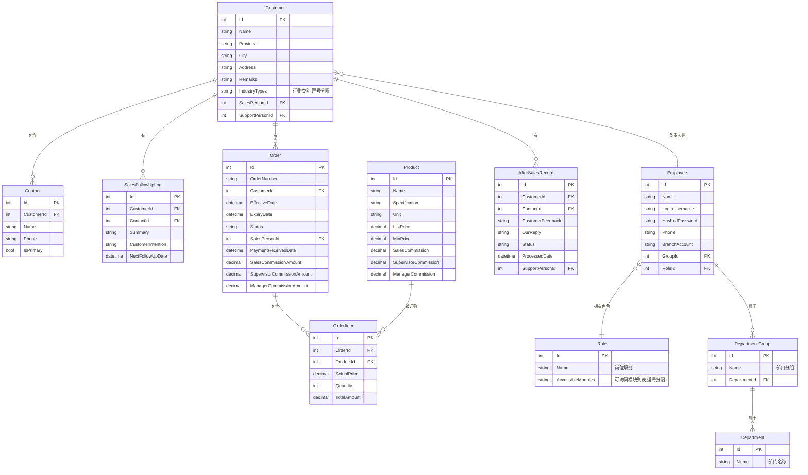

# 销售信息管理系统 - 数据库结构设计文档 (V1.0)

## 1. 实体关系图 (ER Diagram)

本图表展示了系统核心业务实体及其相互关系，是数据库设计的总体蓝图。

## 2. 表结构详述

---

### `Customer` (客户表)

| 字段名 | 数据类型 | 约束 | 备注 |
| :--- | :--- | :--- | :--- |
| Id | `INT` | PK, AUTO_INCREMENT | 主键 |
| Name | `VARCHAR(255)` | NOT NULL, UNIQUE | 客户单位名称 |
| Province | `VARCHAR(50)` | | 省份 |
| City | `VARCHAR(50)` | | 城市 |
| Address | `VARCHAR(255)` | | 详细地址 |
| Remarks | `TEXT` | | 客户备注 |
| IndustryTypes | `VARCHAR(255)`| | 行业类别 (逗号分隔) |
| SalesPersonId | `INT` | FK (Employee.Id) | 负责人(销售) |
| SupportPersonId | `INT` | FK (Employee.Id) | 负责人(客服) |

*索引*: `Name`, `SalesPersonId`, `SupportPersonId`

---

### `Contact` (联系人表)

| 字段名 | 数据类型 | 约束 | 备注 |
| :--- | :--- | :--- | :--- |
| Id | `INT` | PK, AUTO_INCREMENT | 主键 |
| CustomerId | `INT` | NOT NULL, FK (Customer.Id) | 关联的客户ID |
| Name | `VARCHAR(100)` | NOT NULL | 联系人姓名 |
| Phone | `VARCHAR(50)` | | 电话 |
| IsPrimary | `BOOLEAN` | NOT NULL, DEFAULT 0 | 是否为主要联系人 |

*索引*: `CustomerId`

---

### `Product` (产品表)

| 字段名 | 数据类型 | 约束 | 备注 |
| :--- | :--- | :--- | :--- |
| Id | `INT` | PK, AUTO_INCREMENT | 主键 |
| Name | `VARCHAR(255)` | NOT NULL | 产品名称 |
| Specification | `VARCHAR(100)`| | 型号规格 |
| Unit | `VARCHAR(20)` | | 计量单位 |
| ListPrice | `DECIMAL(10, 2)`| NOT NULL | 产品定价 |
| MinPrice | `DECIMAL(10, 2)` | NOT NULL | 最低售价 |
| SalesCommission | `DECIMAL(10, 2)`| | 销售提成 |
| SupervisorCommission| `DECIMAL(10, 2)`| | 主管提成 |
| ManagerCommission| `DECIMAL(10, 2)`| | 经理提成 |

---
### `Order` (订单表)

| 字段名 | 数据类型 | 约束 | 备注 |
| :--- | :--- | :--- | :--- |
| Id | `INT` | PK, AUTO_INCREMENT | 主键 |
| OrderNumber | `VARCHAR(50)` | NOT NULL, UNIQUE | 订单编号 |
| CustomerId | `INT` | NOT NULL, FK (Customer.Id) | 客户ID |
| EffectiveDate | `DATETIME` | | 生效日期 |
| ExpiryDate | `DATETIME` | | 到期日期 |
| Status | `VARCHAR(50)` | NOT NULL | 订单状态 (e.g., '待收款') |
| SalesPersonId | `INT` | NOT NULL, FK (Employee.Id) | 销售人ID |
| PaymentReceivedDate | `DATETIME` | NULL | 到账日期 |
| SalesCommissionAmount | `DECIMAL(10, 2)` | NULL | 销售提成快照 |
| SupervisorCommissionAmount | `DECIMAL(10, 2)` | NULL | 主管提成快照 |
| ManagerCommissionAmount | `DECIMAL(10, 2)` | NULL | 经理提成快照 |

*索引*: `CustomerId`, `SalesPersonId`, `Status`

---
### `OrderItem` (订单项表)

| 字段名 | 数据类型 | 约束 | 备注 |
| :--- | :--- | :--- | :--- |
| Id | `INT` | PK, AUTO_INCREMENT | 主键 |
| OrderId | `INT` | NOT NULL, FK (Order.Id) | 订单ID |
| ProductId | `INT` | NOT NULL, FK (Product.Id) | 产品ID |
| ActualPrice | `DECIMAL(10, 2)`| NOT NULL | 实际售价 |
| Quantity | `INT` | NOT NULL | 数量 |
| TotalAmount | `DECIMAL(10, 2)`| NOT NULL | 订单项总金额 |

*索引*: `OrderId`, `ProductId`

---

### `SalesFollowUpLog` (销售跟进记录)

| 字段名 | 数据类型 | 约束 | 备注 |
| :--- | :--- | :--- | :--- |
| Id | `INT` | PK, AUTO_INCREMENT | 主键 |
| CustomerId | `INT` | NOT NULL, FK (Customer.Id) | 客户ID |
| ContactId | `INT` | FK (Contact.Id) | 联系人ID |
| Summary | `TEXT` | | 联系概要 |
| CustomerIntention | `VARCHAR(50)` | | 客户意向 (高,中,低,无) |
| NextFollowUpDate| `DATETIME` | | 下次跟进日期 |

*索引*: `CustomerId`

---

### `AfterSalesRecord` (售后记录)

| 字段名 | 数据类型 | 约束 | 备注 |
| :--- | :--- | :--- | :--- |
| Id | `INT` | PK, AUTO_INCREMENT | 主键 |
| CustomerId | `INT` | NOT NULL, FK (Customer.Id) | 客户ID |
| ContactId | `INT` | FK (Contact.Id) | 联系人ID |
| CustomerFeedback| `TEXT` | | 客户反馈 |
| OurReply | `TEXT` | | 售后回复 |
| Status | `VARCHAR(50)` | NOT NULL | 处理状态 (待处理,处理中,处理完成) |
| ProcessedDate | `DATETIME` | | 处理时间 |
| SupportPersonId | `INT` | FK (Employee.Id) | 客服ID |

*索引*: `CustomerId`, `SupportPersonId`

---

### `Employee` (员工表)

| 字段名 | 数据类型 | 约束 | 备注 |
| :--- | :--- | :--- | :--- |
| Id | `INT` | PK, AUTO_INCREMENT | 主键 |
| Name | `VARCHAR(100)` | NOT NULL | 员工姓名 |
| LoginUsername | `VARCHAR(100)` | NOT NULL, UNIQUE | 登录账号 |
| HashedPassword| `VARCHAR(255)` | | 加密后的密码 |
| Phone | `VARCHAR(50)` | NULL | 电话号码 |
| BranchAccount | `VARCHAR(100)`| NULL | 网点账号 |
| GroupId | `INT` | FK (DepartmentGroup.Id) | 所属分组ID |
| RoleId | `INT` | FK (Role.Id) | 岗位职务ID (角色) |

*索引*: `LoginUsername`, `GroupId`, `RoleId`

---
### `Role` (角色/岗位表)

| 字段名 | 数据类型 | 约束 | 备注 |
| :--- | :--- | :--- | :--- |
| Id | `INT` | PK, AUTO_INCREMENT | 主键 |
| Name | `VARCHAR(100)` | NOT NULL, UNIQUE | 岗位职务名称 |
| AccessibleModules| `TEXT` | | 可访问的模块名列表,逗号分隔 |

---

### `Department` (部门表)

| 字段名 | 数据类型 | 约束 | 备注 |
| :--- | :--- | :--- | :--- |
| Id | `INT` | PK, AUTO_INCREMENT | 主键 |
| Name | `VARCHAR(100)` | NOT NULL, UNIQUE | 部门名称 |

---

### `DepartmentGroup` (部门分组表)

| 字段名 | 数据类型 | 约束 | 备注 |
| :--- | :--- | :--- | :--- |
| Id | `INT` | PK, AUTO_INCREMENT | 主键 |
| Name | `VARCHAR(100)` | NOT NULL | 分组名称 |
| DepartmentId| `INT` | NOT NULL, FK (Department.Id) | 所属部门ID |

*索引*: `DepartmentId`
